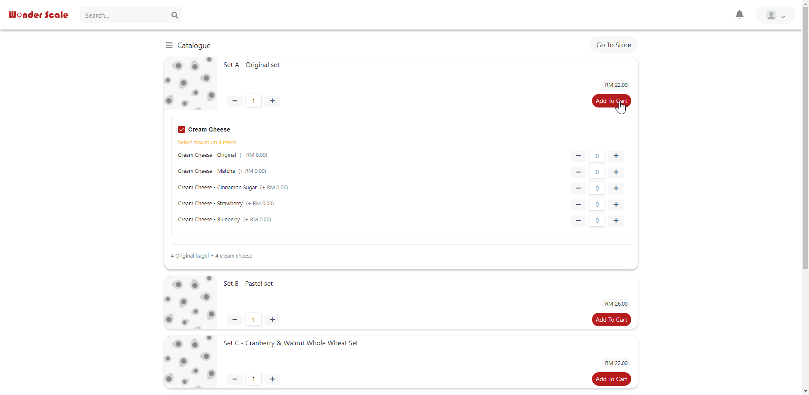

# Wonder Scale Website
A website to display the information of the merchant's store. User can purchase and keep track on the status in the website.

# Screen Shots:
Store Page - Website:
<kbd></kbd>
<kbd></kbd>

Store Page - Mobile:
<kbd></kbd>

Store Page - Cart List:
<kbd></kbd>

Store Page - Mobile - Cart List:
<kbd></kbd>

Store Page - Items:
<kbd></kbd>

Items Purchase Status:
<kbd></kbd>

User profile - Page:
<kbd></kbd>

User profile - Address:
<kbd></kbd>

User profile - Security:
<kbd></kbd>

# WonderScaleWebsite

This project was generated with [Angular CLI](https://github.com/angular/angular-cli) version 9.0.3.

## Development server

Run `ng serve` for a dev server. Navigate to `http://localhost:4200/`. The app will automatically reload if you change any of the source files.

## Code scaffolding

Run `ng generate component component-name` to generate a new component. You can also use `ng generate directive|pipe|service|class|guard|interface|enum|module`.

## Build

Run `ng build` to build the project. The build artifacts will be stored in the `dist/` directory. Use the `--prod` flag for a production build.

## Running unit tests

Run `ng test` to execute the unit tests via [Karma](https://karma-runner.github.io).

## Running end-to-end tests

Run `ng e2e` to execute the end-to-end tests via [Protractor](http://www.protractortest.org/).

## Further help

To get more help on the Angular CLI use `ng help` or go check out the [Angular CLI README](https://github.com/angular/angular-cli/blob/master/README.md).
